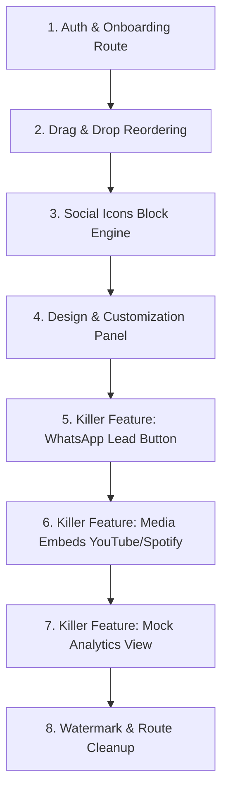

# VibeLink MVP (MLP) Frontend Task Checklist

This is a comprehensive, step-by-step developer checklist for implementing the frontend features of the VibeLink MVP/MLP. Follow these tasks one by one to ensure speed, focus, and high-quality implementation.

---

## High-Level Roadmap



---

## 1. User Auth & Onboarding Flow
Implement the routes and client views for user access and setting up their unique handle.

- [ ] **1.1. Setup Auth and Onboarding Routes**
  - [ ] Create the route files inside `src/routes/`:
    - [ ] `src/routes/auth/login.tsx`
    - [ ] `src/routes/auth/signup.tsx`
    - [ ] `src/routes/onboarding.tsx`
  - [ ] Re-generate TanStack Router paths by running `npx wrangler types` or let Vite's Router plugin auto-detect them.
- [ ] **1.2. Design the Login Page UI**
  - [ ] Implement a premium modern glassmorphic card interface.
  - [ ] Fields: Email, Password.
  - [ ] Add floating background gradients (using Lucide icons and subtle CSS floating animations in `src/index.css`).
  - [ ] Add interactive validation (e.g. valid email syntax, minimum password length).
- [ ] **1.3. Design the Signup & Claim Username Page UI**
  - [ ] Implement a form for signing up (Email, Password).
  - [ ] Add a live interactive field: **Claim your URL** (e.g., `vibelink.co/` followed by an input).
  - [ ] Add a micro-animation checks for username availability:
    - [ ] As the user types, show a loading spinner, then a green checkmark `Available!` or red cross `Taken`.
    - [ ] Mock this using a `setTimeout` of 500ms and a set of local forbidden usernames (e.g. `admin`, `vibelink`, `root`).
- [ ] **1.4. Build the Onboarding Flow**
  - [ ] Once signed up, redirect to `/onboarding` if profile metadata is not set.
  - [ ] Onboarding steps:
    - [ ] Step 1: Input display name and avatar category.
    - [ ] Step 2: Input bio description (validate max 150 characters with a remaining-character count indicator).
    - [ ] Step 3: Click "Go to Dashboard" to write mock state and redirect to `/builder-new`.

---

## 2. Drag & Drop Reordering Engine
Enable intuitive vertical reordering of user elements (links, carousels, embeds).

- [ ] **2.1. Implement HTML5 Drag and Drop Handlers**
  - [ ] Inside `src/routes/builder-new.tsx`, write state reordering logic:
    ```typescript
    const handleReorderLinks = (draggedId: string, targetId: string) => {
      setLinks((prev) => {
        const draggedIndex = prev.findIndex(item => item.id === draggedId);
        const targetIndex = prev.findIndex(item => item.id === targetId);
        if (draggedIndex === -1 || targetIndex === -1) return prev;
        const newLinks = [...prev];
        const [removed] = newLinks.splice(draggedIndex, 1);
        newLinks.splice(targetIndex, 0, removed);
        return newLinks;
      });
    };
    ```
- [ ] **2.2. Add Drag Events to `LinkEditorItem`**
  - [ ] In `src/components/builder/link-editor-item.tsx`, add HTML5 drag attributes:
    - [ ] Add `draggable` to the item card wrapper or drag handle.
    - [ ] Implement `onDragStart` (store the item's ID in `e.dataTransfer.setData('text/plain', item.id)`).
    - [ ] Implement `onDragOver` (call `e.preventDefault()`).
    - [ ] Implement `onDrop` (retrieve the dragged ID and invoke the reorder state function).
- [ ] **2.3. Apply Drag-and-Drop Visual Polish**
  - [ ] Apply custom Tailwind class transitions for active dragging states (e.g. drop shadow, opacity change, border glow).
  - [ ] Ensure the grab cursor is correctly set on `GripVertical` icon.

---

## 3. Dedicated Social Icon Row Block
Add a specialized row block at the top or bottom of the profile rather than standard buttons.

- [ ] **3.1. Expand Schema for Social Links**
  - [ ] In `src/components/builder/types.ts`, support platforms: `instagram`, `x`, `linkedin`, `youtube`, `email`.
  - [ ] Update `SocialsState` type to support these platforms.
- [ ] **3.2. Build the Social Grid Editor Component**
  - [ ] Modify `src/components/builder/social-accounts-card.tsx` to display styling controls:
    - [ ] Add input fields for: Instagram, X, LinkedIn, YouTube, and Email.
    - [ ] Add visibility switches for each input.
    - [ ] Add a selection for layout alignment: `Top` (below bio) or `Bottom` (footer-pinned).
- [ ] **3.3. Update Mockup Live View**
  - [ ] Modify `src/components/builder/mobile-mockup.tsx`:
    - [ ] Render the social icon block dynamically based on the selected alignment.
    - [ ] Style the icons to automatically inherit the current profile text color (`var(--phone-text)`).

---

## 4. Customization & Styling Engine
Attack Linktree's paywalls by giving users dynamic HEX color pickers, fonts, and style options.

- [ ] **4.1. Define Design State Variables**
  - [ ] In `src/routes/builder-new.tsx`, add a custom styling state:
    ```typescript
    const [pageTheme, setPageTheme] = useState({
      bgColor: '#ffffff',
      textColor: '#18181b',
      btnBgColor: '#18181b',
      btnTextColor: '#ffffff',
      btnShape: 'rounded', // 'rectangle' | 'rounded' | 'pill'
      fontFamily: 'Inter',  // 'Inter' | 'Playfair Display' | 'Roboto' | 'Courier'
    });
    ```
- [ ] **4.2. Create Design Customizer Card Component**
  - [ ] Create `src/components/builder/design-customizer-card.tsx`:
    - [ ] **HEX Pickers:** Render color picker fields (`<input type="color" />`) styled as sleek circles showing the color code next to them. Include color pickers for: Page Background, Text, Button Background, Button Text.
    - [ ] **Button Style Selector:** A segmented picker for:
      - [ ] Solid Rectangle (`border-radius: 0px`)
      - [ ] Rounded Edges (`border-radius: 8px`)
      - [ ] Pill Shape (`border-radius: 9999px`)
    - [ ] **Font Picker:** A custom select dropdown showcasing available Google Fonts: Inter (Modern), Playfair Display (Elegant), Roboto (Clean), Courier (Tech).
    - [ ] **Pre-made Themes:** Buttons to instantly apply preset themes:
      - [ ] *Light Mode:* Bg `#ffffff`, Text `#18181b`, Button Bg `#18181b`, Button Text `#ffffff`
      - [ ] *Dark Mode:* Bg `#121214`, Text `#f4f4f5`, Button Bg `#ffffff`, Button Text `#121214`
      - [ ] *Neon:* Bg `#0f0c1b`, Text `#f4f4f5`, Button Bg `#6366f1`, Button Text `#ffffff`
- [ ] **4.3. Implement Live Styling Application in Preview**
  - [ ] Modify `src/components/builder/mobile-mockup.tsx` and `src/components/builder/element-renderer.tsx`:
    - [ ] Use inline style injection or dynamic CSS custom properties:
      ```typescript
      style={{
        '--phone-bg': pageTheme.bgColor,
        '--phone-text': pageTheme.textColor,
        '--phone-btn-bg': pageTheme.btnBgColor,
        '--phone-btn-text': pageTheme.btnTextColor,
        '--phone-btn-radius': pageTheme.btnShape === 'rectangle' ? '0px' : pageTheme.btnShape === 'rounded' ? '8px' : '9999px',
        '--phone-font': pageTheme.fontFamily,
      } as React.CSSProperties}
      ```
    - [ ] Dynamically load the Google Font by appending a `<link>` stylesheet inside the React component's `useEffect` when the font changes.

---

## 5. Killer Feature: Direct WhatsApp Button
Create an offline business lead generation block that generates WhatsApp chat redirects.

- [ ] **5.1. Add WhatsApp Block Type to Element Types**
  - [ ] In `src/components/builder/types.ts`, add `'whatsapp'` to `ElementType`.
  - [ ] Extend the `PageElement` union type:
    ```typescript
    export interface WhatsAppElement extends BaseElement {
      type: 'whatsapp';
      phone: string;
      message: string;
      title: string;
    }
    ```
- [ ] **5.2. Add WhatsApp Editor Interface**
  - [ ] In `src/components/builder/link-editor-item.tsx`, add a renderer for type `'whatsapp'`:
    - [ ] Text field for "Button Label" (default: "Chat on WhatsApp").
    - [ ] Phone number field with validation helper.
    - [ ] Pre-filled message textarea (e.g. "Hi, I'd like a quote!").
- [ ] **5.3. Build WhatsApp Mockup Render**
  - [ ] In `src/components/builder/element-renderer.tsx`, add support for rendering `'whatsapp'`:
    - [ ] Renders a styled button with a WhatsApp brand icon (colored green `#25D366` or styled matching custom buttons).
    - [ ] URL structure: `https://wa.me/{phone}?text={encodeURIComponent(message)}`.

---

## 6. Killer Feature: Spotify & YouTube Media Embeds
Convert Spotify/YouTube URLs directly into playable iframes inside the live preview.

- [ ] **6.1. Add Spotify Support to Embed Blocks**
  - [ ] In `src/components/builder/types.ts`, expand the embed block definition to support Spotify.
- [ ] **6.2. Embed URL Identification Helper**
  - [ ] Write a utility parser function to extract Spotify album, playlist, or track IDs:
    - [ ] *Spotify playlist pattern:* `open.spotify.com/playlist/([a-zA-Z0-9]+)`
    - [ ] *Spotify track pattern:* `open.spotify.com/track/([a-zA-Z0-9]+)`
- [ ] **6.3. Render Playable Iframes in live Mockup**
  - [ ] Update `src/components/builder/element-renderer.tsx`:
    - [ ] If the item is YouTube, render the playable YouTube embed player:
      `https://www.youtube.com/embed/{videoId}`
    - [ ] If the item is Spotify, render the Spotify player widget:
      `https://open.spotify.com/embed/{type}/{id}`
    - [ ] Maintain correct aspect-ratios (16:9 for YouTube, heights of 80px/152px/352px for Spotify widgets) and responsive styling.

---

## 7. Killer Feature: Basic Analytics Dashboard Tab
Provide a dashboard view showing lifetime stats, clicks, and CTR metrics.

- [ ] **7.1. Create the Analytics Tab Layout**
  - [ ] Create a new component `src/components/builder/analytics-card.tsx`.
  - [ ] Include summary metrics:
    - [ ] **Total Page Views:** (e.g., Lifetime: 1,420, Last 7 Days: 340)
    - [ ] **Total Link Clicks:** (e.g., 580)
    - [ ] **Average CTR (Click-Through Rate):** (e.g., 40.8%)
- [ ] **7.2. Implement Visual Mock Charts**
  - [ ] Render an interactive, clean SVG line chart representing page views and click progression over the last 7 days.
  - [ ] Highlight individual link clicks in a table sorted by most clicked.
- [ ] **7.3. Integrate Analytics into Dashboard view**
  - [ ] In `src/routes/builder-new.tsx`, add a tab selector (e.g. **Design**, **Links**, **Analytics**) in the navigation to toggle between views cleanly.

---

## 8. Smart Watermark & Route Cleanup
Polish details for public presentation and finalize routing.

- [ ] **8.1. Implement the Smart Watermark**
  - [ ] In `src/components/builder/mobile-mockup.tsx`, update the footer to render:
    - [ ] **⚡ Built with VibeLink**
    - [ ] Clicking the watermark links directly to the `/auth/signup` page.
- [ ] **8.2. Clean up Old Builder Page**
  - [ ] Delete `src/routes/builder.tsx`.
  - [ ] Rename `src/routes/builder-new.tsx` to `src/routes/builder.tsx`.
  - [ ] Re-generate Router files to match the cleaned route tree.
- [ ] **8.3. Verify Build & Code Correctness**
  - [ ] Run `npm run build` locally to verify that TypeScript types build cleanly.
  - [ ] Fix any type errors, unused variables, or missing imports.
